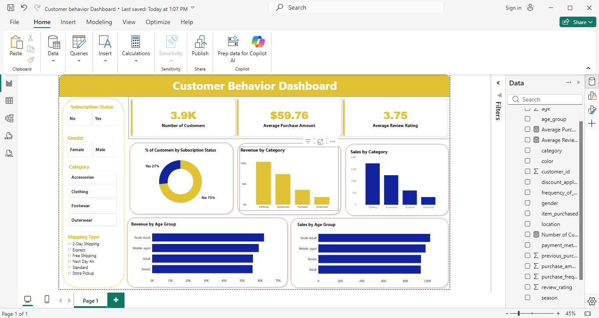

# 📊 Data Analytics End-to-End Project

## 📌 Overview
This project is an end-to-end data analytics solution that demonstrates the full data workflow: from data loading and cleaning in Python, to querying with SQL, and finally building interactive dashboards in Power BI. The goal is to extract meaningful insights and present them in a clear, visual format for decision-making.

---

## 📁 Dataset
- The dataset contains business/customer-related records used for analysis.
- It includes structured data suitable for cleaning, transformation, and visualization.
- (Add dataset source or description here if available)

---

## 🛠 Tools & Technologies
- Python (Pandas)
- MySQL Server
- SQL (Data querying & aggregation)
- Power BI (Dashboard & visualization)
- Jupyter Notebook / VS Code

---

## 🔄 Project Workflow

### 1. Data Loading
- Imported dataset using Python (Pandas)
- Performed initial inspection of data structure

### 2. Data Cleaning
- Handled missing values
- Removed duplicates
- Standardized data formats
- Renamed columns for consistency

### 3. Exploratory Data Analysis (EDA)
- Generated summary statistics
- Visualized trends and patterns
- Identified key insights from the dataset

### 4. SQL Analysis (MySQL Server)
- Imported cleaned dataset into MySQL
- Wrote SQL queries for:
  - Filtering and sorting data
  - Aggregations (SUM, COUNT, AVG)
  - Grouping and segmentation
  - Business insights extraction

### 5. Power BI Dashboard
- Connected Power BI to cleaned dataset / SQL output
- Built interactive dashboards
- Created KPIs and visual reports

### 6. Reporting
- Summarized findings from Python, SQL, and Power BI
- Presented insights for decision-making

---

## 📊 Dashboard Preview
*(Add your Power BI screenshot here)*

```markdown

```

---

## 📈 Key Insights
- Identified key trends from the dataset
- Discovered patterns in customer behavior
- Highlighted important KPIs for decision-making
- Provided actionable insights through visualization

---

